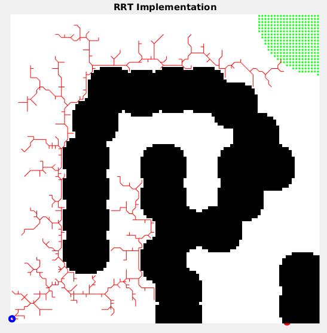

# RRT Algorithm: 
## Rapidly-Exploring Random Tree

#### Author: Chahat Deep Singh
#### March 27 2017
#### University of Maryland College Park
 -----------------------------------
 
Instructions:
============
 - Run the file RunMe.m in Matlab (R2007b+)
 - Make sure the files:
 	(a). create_map (Not required for the RunMe file)
 	(b). draw
 	(c). edge_fn
 	(d). find_new_node
 	(e). goal_edge
 	(f). map.mat
 	(g). nearest
 	(h). RRT 
  (i). problem
 	are in the same folder.
 	
 - If there is no map.mat, run create_map file to generate
 	the map with obstacles. (it will generate map.mat)
 - To update the map, run create_map.m and then Run RunMe.m for RRT.
 - Input argunments are to be changed in 'problem.m' file

Input Arguments:
================
- Start Node: start_node [x y]
- End Goal: goal [x y]
- r_goal: Radius of the End Goal region
- Epsilon: Minimum Step size for the RRT
- [Change the input data](problem.m)

Sample Outputs
=======
- [Output 1](Output/p1.png)
- [Output 2](Output/p2.png)
- [Output 3](Output/p3.png)
- [Output 4](Output/p4.png)
- [Output 5](Output/p5.png)

Requirements
============
- Matlab R2007b or later.

Notes
=======
- Tested on MATLAB R2016b, Arch Linux 2017.03.01, Kernel: 4.9.11

License
============
RRT (Rapidly-Exploring Random Trees) using [the MIT license](LICENSE).
